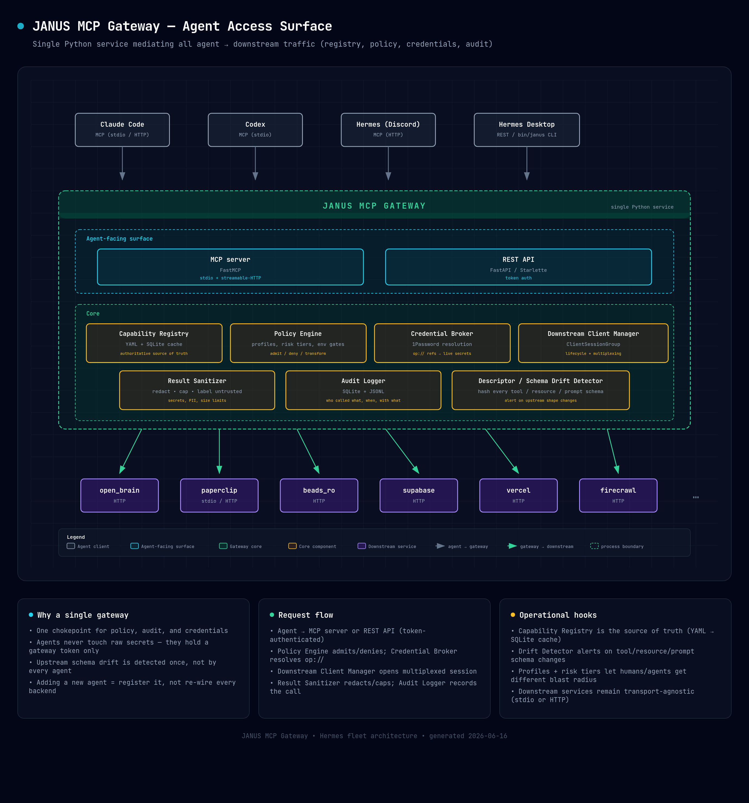

<p align="center">
  
</p>

<h1 align="center">Janus</h1>

<p align="center">
  <strong>An MCP gateway and capability broker.</strong><br>
  One small, stable tool surface in front of every downstream MCP server —
  just-in-time discovery, deny-by-default policy, credential isolation, and a full audit trail.
</p>

<p align="center">
  
  
  
  
  
</p>

---

## The problem

Every capable agent loads its tools by connecting to MCP servers. As an operator adds servers —
issue tracker, notes/memory, project board, databases, billing, deploy tooling — **every session
pays the full context cost of every tool schema**, the model's tool-selection accuracy degrades,
and credentials for all of those services are scattered across per-agent configs.

Loading *N* servers into *every* session does not scale.

## What Janus does

An agent loads **one** server — Janus — which exposes a small, fixed set of **broker tools** and
keeps the dozens of downstream tools as an implementation detail behind a registry, policy engine,
credential broker, sanitizer, and audit log:

```text
capability.search(query)      → a short, ranked list of relevant capabilities (no full schemas)
capability.describe(id)       → the schema + risk tier + policy for one capability
capability.call(id, args)     → a policy-checked, credential-injected, audited invocation
server.list / server.health   → downstream inventory + liveness
policy.explain(id)            → why an action is allowed / denied / needs confirmation
audit.recent(limit)           → the recent invocation log
```

The model sees **~7 broker tools instead of 100+ downstream tools**. Capabilities are discovered
*just in time* (`search → describe → call`) rather than dumped up front, and every call is brokered:
checked against policy, given credentials the model never sees, size-capped and secret-redacted,
and logged.

## Architecture

<p align="center">
  
</p>

Clients (Claude Code, Codex, an SSH/REST consumer) reach Janus over **MCP** *or* the **REST/CLI**
fallback. The gateway resolves each call through five cooperating subsystems before it ever touches
a downstream server:

| Subsystem | Responsibility |
|---|---|
| **Registry** | Source-of-truth catalog of servers + capabilities (transport, trust level, risk ceiling, env scope). Public-repo-safe YAML seed; runtime state in a local SQLite `SchemaStore`. |
| **Policy engine** | Deny-by-default decision per call from `(profile, risk tier, environment)` → **allow / confirm / deny**, with a human-readable reason. |
| **Credential broker** | Resolves secret references (e.g. `op://…`) at call time, injects them into the downstream env/headers, caches them in memory with a TTL, and **never logs or returns them**. |
| **Sanitizer** | Caps output size, redacts secrets, and labels untrusted downstream content before it reaches the model. |
| **Audit + drift** | Append-only JSONL + SQLite invocation log; descriptor/schema **drift detection** that auto-quarantines a changed capability until it is re-approved. |

## Key properties

- **Small fixed tool surface** → lower context cost and better tool selection.
- **Staged just-in-time discovery** — `search → describe → call`, never a full schema dump.
- **Deny-by-default policy** with risk tiers (`read_only` … `local_write` … `prod_write` …
  `destructive` / `financial`) and environment gates (`dev` / `test` / `prod_safe` / `prod`),
  scoped per **agent profile**.
- **Credentials owned by the gateway**, resolved from an external secret manager at call time —
  never exposed to the model or written to logs.
- **Untrusted tool metadata neutralized** — human-reviewed summaries; descriptor/schema drift is
  detected and quarantined.
- **Every invocation audited.**
- **Dual interface** — MCP for capable hosts, REST/CLI for everything else.
- **Self-sufficient** — runs as a `systemd --user` service that survives a reboot with no shell
  session present; `--check` fails loudly on missing configuration.

## Project status

Janus is built in deliberate phases — value lands early; risk (write tools, lazy lifecycle) is
added only after policy and audit are solid.

| Phase | Scope | Status |
|---|---|---|
| **1** | Static registry · 7 broker tools · policy engine · credential broker · audit · REST/CLI · systemd | ✅ **Implemented & deployed** |
| **2** | Downstream discovery crawler · approval workflow · descriptor-drift auto-quarantine + alerts | ✅ **Implemented** |
| 3 | Full policy engine · write tools behind confirmation · lethal-trifecta session tracking | ⏳ Planned |
| 4 | Lazy downstream lifecycle (on-demand start, idle shutdown, circuit breakers) | ⏳ Planned |
| 5 | Semantic capability search (embeddings over sanitized summaries) | ⏳ Planned |
| 6 | Dynamic native-tool exposure for hosts that support `tools/list_changed` | ⏳ Optional |

The reference deployment currently brokers **Beads** and **Paperclip** (read-only). An **Open Brain**
memory downstream is pending multi-header HTTP auth support.

## Quick start

```bash
# 1. Environment (Python 3.11+)
uv venv && uv pip install -e .

# 2. Configure — copy the env template and fill in per-host tokens + downstream endpoints
cp config/janus.env.template janus.env   # then edit; keep it out of git (gitignored)

# 3. Validate configuration (the systemd ExecStartPre gate — exits non-zero on problems)
python -m janus --check

# 4. Serve
python -m janus --serve       # REST API (always-on networked surface)
python -m janus --mcp-http    # MCP over streamable-HTTP
python -m janus --stdio       # MCP over stdio (per-session spawn)
```

Run it as a managed service with the bundled unit:

```bash
cp systemd/janus.service ~/.config/systemd/user/
systemctl --user enable --now janus.service
loginctl enable-linger     # survive logout / reboot
```

## CLI

**`bin/janus`** — thin client over the REST API for SSH / scripted use. Reads `JANUS_URL`
(default `http://127.0.0.1:8088`) and a per-host `JANUS_TOKEN` from the environment:

```bash
bin/janus search "open issues assigned to me"
bin/janus describe <capability-id>
bin/janus call <capability-id> '{"arg": "value"}'
bin/janus servers          # inventory + health
bin/janus explain <capability-id>
bin/janus audit --limit 20
```

**`bin/janus-admin`** — host-local administration (talks to the registry SQLite directly,
never over the network):

```bash
bin/janus-admin discover                       # crawl downstreams, refresh observations
bin/janus-admin pending                        # capabilities awaiting first approval
bin/janus-admin approve <id>                   # approve + lock the reviewed baseline
bin/janus-admin diff <id>                      # baseline-vs-observed descriptor delta
bin/janus-admin quarantine-capability <id>
bin/janus-admin quarantine-server <id>
```

## Configuration

All configuration lives in `config/` and is **public-repo-safe** — it contains no secrets, tokens,
`op://` references, or internal endpoints. Connection details and credentials are supplied at
runtime via the named environment variables the credential broker resolves.

| File | Purpose |
|---|---|
| `servers.yaml` | Downstream server registry — transport, trust level, risk ceiling, env scope. |
| `capabilities.yaml` | Per-capability summaries, tags, and risk tiers (the searchable surface). |
| `profiles.yaml` | Agent profiles (e.g. `default_assistant`, `infra_operator`) → allowed / confirm / denied risk tiers per environment. |
| `janus.env.template` | Documented template for the per-host env file (downstream URLs + tokens, `JANUS_TOKENS`, optional alert webhook). |

## Security model

- **No secret ever reaches the model or the audit log** — the credential broker injects them
  downstream and the sanitizer redacts them on the way back. This is asserted by tests.
- **Deny-by-default** — a capability is uncallable until it is approved, and any risk tier above a
  profile's allowance is denied or gated behind confirmation, with `policy.explain` giving the reason.
- **Tool-poisoning resistance** — model-visible text comes from human-reviewed summaries, not raw
  downstream descriptions; a descriptor/schema change auto-quarantines the capability until it is
  re-reviewed.

## Development

```bash
uv run ruff check .          # lint (includes bandit security rules)
uv run mypy src              # strict type checking
uv run pytest                # 108 tests
```

The substrate is the official [`modelcontextprotocol/python-sdk`](https://github.com/modelcontextprotocol/python-sdk)
(`ClientSessionGroup` for downstream connections) plus [`fastmcp`](https://github.com/jlowin/fastmcp)
for the broker surface. Janus keeps a thin adapter over both so SDK churn stays localized.

## Repository layout

```text
janus/
├── bin/                  janus (REST client) · janus-admin (local admin)
├── config/               servers · capabilities · profiles · env template
├── docs/                 documentation + diagrams
├── src/janus/
│   ├── registry/         registry loader + SQLite SchemaStore
│   ├── downstream/       ClientSessionGroup manager (stdio + HTTP, tolerant connect)
│   ├── policy/           deny-by-default profile policy engine
│   ├── security/         credential broker · secret redactor · output sanitizer
│   ├── audit/            JSONL + SQLite invocation log
│   ├── discovery/        crawler · drift detection · alerts
│   ├── admin/            approval / quarantine CLI service
│   ├── broker.py         the 7 broker tools' logic
│   ├── server_mcp.py     FastMCP surface
│   ├── server_rest.py    FastAPI REST mirror
│   └── gateway.py        composition root
└── tests/                unit + integration (fake downstream MCP server)
```

## License

To be determined. Until a license file is added, all rights are reserved by the authors.
